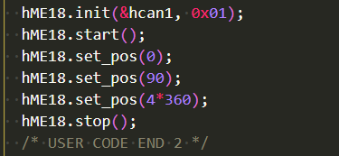

# ME18舵机库使用说明

WTR——梁思奇 2020/12/20

****

思路：通过CAN通信发送特定格式报文，控制ME18舵机

以大疆开发板A型为例 ——STM32F427IIHx

## CubeMx配置

时钟树配置 注意APB1为42MHz


CAN配置 此处使用CAN1 将can通信波特率配置为1MHz即可

1MHz = 42MHz / 3  / (9+4+1)


使能接收中断


注意大疆开发板的CAN1使用的是PD0和PD1 和Cube默认的有差别 需要更改一下


## 代码

添加ME18.c和.h。

拥有句柄 *hME18*

```c
hME18.init(CAN_HandleTypeDef hcan,uint8_t STDID); //进行初始化 传入can句柄和舵机can通信的标准标识符

/*  ME18舵机默认的STDID为0x01 */

hME18.start(); //开启舵机FOC工作模式

hME18.stop(); //关闭舵机FOC工作模式 此时舵机停止

hME18.set_pos(uint16_t pos); //传入舵机转动的目标角度 范围0~8*360 单位 (度°)
```



此外还有

```C
hME18.reset()
/* 该命令在舵机启动过FOC模式并且发送过位置信息后可以被使用 会使舵机转动至某一角度 但非固定角度 具体用途待进一步发现 */
```

该命令为参考开发文档编写的 ”复位电机位置变量“ 的函数 经测试其用途并非是复位舵机至某一位置 还需在实际使用中进一步发现其作用

