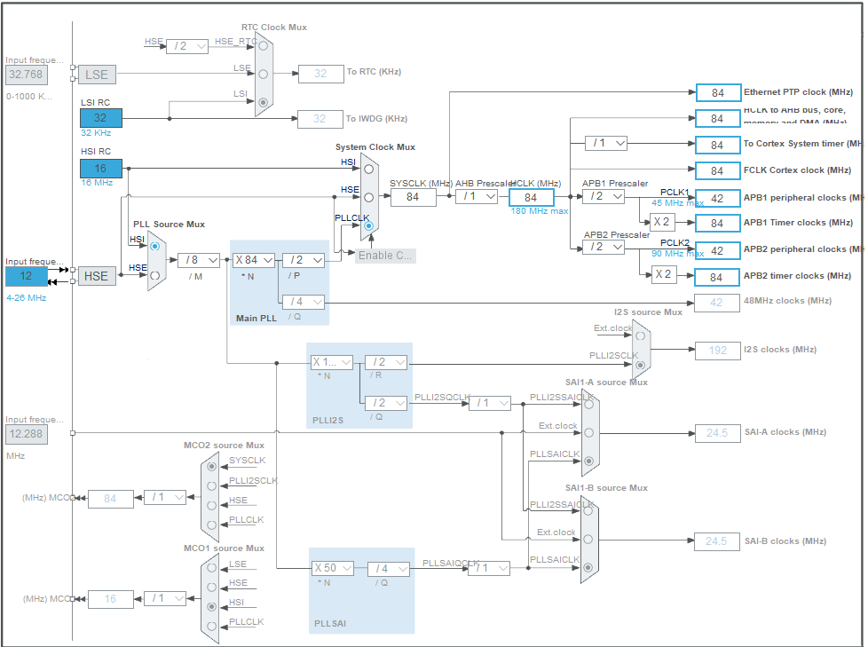
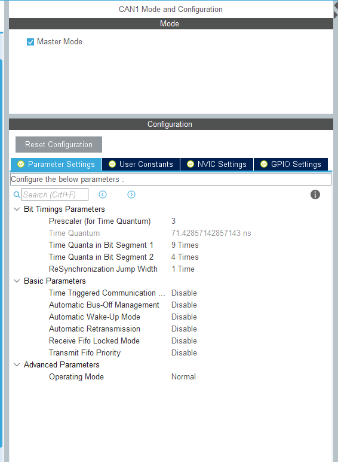
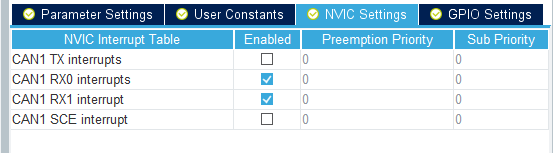
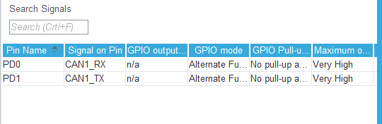
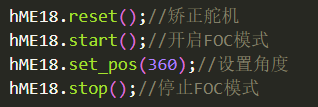

# ME18舵机库使用说明

WTR——梁思奇 2020/12/20

****

思路：通过CAN通信发送特定格式报文，控制ME18舵机

以大疆开发板A型为例 ——STM32F427IIHx

## CubeMx配置

时钟树配置 注意APB1为42MHz



CAN配置 此处使用CAN1 将can通信波特率配置为1MHz即可

1MHz = 42MHz / 3  / (9+4+1)



使能接收中断



注意大疆开发板的CAN1使用的是PD0和PD1 和Cube默认的有差别 需要更改一下



## 代码

添加ME18.c和.h。

### ME18结构体

```c
typedef struct 
{	
	CAN_HandleTypeDef *hcan;	//发送can消息使用句柄
	uint32_t STDID;				//发送can消息Stdid
    struct 
	{
		float position;			//反馈获得的电机位置 范围 -4π~4π 单位(rad)
		float velocity;			//反馈获得的电机速度
		float current; 			//反馈获得的电机电流
	}FdbData;	

	void (*init)(CAN_HandleTypeDef *hcan,uint32_t STDID);  	//进行初始化 传入can句柄和舵机can通信的标准标识符
	void (*reset)(void);									//矫正舵机让舵机转的更准 执行时舵机会自转两周 
	void (*stop)(void);										//关闭舵机FOC工作模式 此时舵机停止				
	void (*start)(void);									//开启舵机FOC工作模式
	void (*set_pos)(float pos);								//传入舵机转动的目标角度 范围-720~720 单位 (度°)
}ME18_HandleTypeDef;
```

此为ME18主要结构体 

拥有句柄 *hME18*

```c
hME18.init(CAN_HandleTypeDef hcan,uint8_t STDID); //进行初始化 传入can句柄和舵机can通信的标准标识符

/*  ME18舵机默认的STDID为0x01 */

hME18.reset(); //矫正舵机让舵机转的更准 执行时舵机会自转两周 

hME18.start(); //开启舵机FOC工作模式

hME18.stop(); //关闭舵机FOC工作模式 此时舵机停止

hME18.set_pos(uint16_t pos); //传入舵机转动的目标角度 范围-720~720 单位 (度°)
```



### can消息解码

```c
HAL_StatusTypeDef ME18_CanMsgDecode(uint32_t Stdid, uint8_t* fdbData);
```

此函数会对收到的can消息进行解码

`Stdid`为can消息Stdid

`fdbData` 为收到的can消息 

如果Stdid对应上则会更新hME18中position信息 并返回`HAL_OK`

can消息Stdid对应失败则返回`HAL_ERROR`

**解码部分 速度和电流解码没写出来 等个有缘人来修吧**